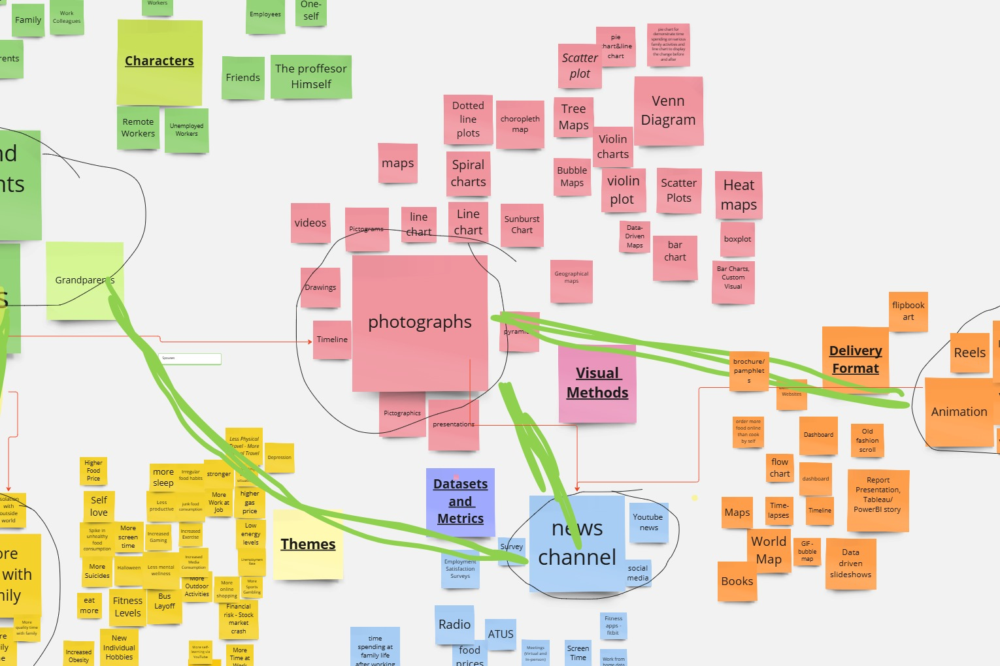

# Ideation 

## Introduction
The Miroboard captures the results of a collaborative in-class activity aimed at exploring diverse ways to present and visualize information. It highlights the interplay of various components such as themes, characters, datasets, visual methods, and delivery formats. The board's structure reflects a brainstorming session where participants generated ideas across categories like "Themes" (e.g., fitness levels, mental health), "Visual Methods" (e.g., scatter plots, maps, photographs), and "Delivery Formats" (e.g., reels, animations, websites). This exercise showcases collective creativity and innovative thinking, emphasizing the importance of integrating storytelling with data visualization to effectively communicate complex ideas.

## Final Output
The activity successfully fostered engagement and creativity by encouraging participants to think holistically about data presentation. By linking themes to characters, datasets, and visual tools, the Miroboard serves as a visual map of how information can be tailored for different audiences. The integration of delivery formats further enriches the approach, ensuring accessibility and relevance. Overall, this exercise provided a valuable framework for applying innovative methodologies in real-world projects, paving the way for impactful and dynamic communication strategies.

