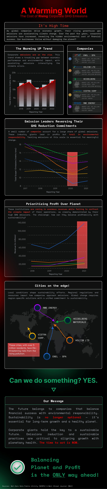

## Introduction
The infographic highlights the alarming trends in greenhouse gas (GHG) emissions driven by corporate activities and their significant role in the escalating climate crisis. Through visually engaging elements, the infographic explores the critical need for balancing corporate profitability with environmental responsibility. By spotlighting key emission leaders, their reversal of reduction commitments, and the cities at risk due to pollution, it conveys a powerful message: sustainability is no longer optional—action is essential for a healthier planet and a sustainable future.

## Iterations 
The creation of this infographic began with thorough research and data gathering in **Iteration 1**, focusing on the role of corporate activities in driving rising greenhouse gas (GHG) emissions. Key insights were drawn from sources like the Net-Zero Data Public Utility (NZDPU) and the *Wall Street Journal* (WSJ), revealing that a small number of industry giants contribute disproportionately to global emissions. The research also emphasized the reversal of corporate commitments to reduce emissions and the dire risks faced by cities with over five million residents due to pollution. This foundational data was critical for shaping the narrative and selecting impactful visuals for the infographic.  

In **Iteration 2**, the structure of the infographic was designed using Canva, with a focus on presenting complex data in a clear, visually appealing way. Charts and timelines were introduced to illustrate emission trends from 2018 to 2022, while sections were dedicated to the environmental and societal impacts of corporate emissions. **Iteration 3** involved refining these visuals and enhancing storytelling by adding elements such as a bubble chart identifying corporate emission leaders, highlighting at-risk cities, and including strong, action-oriented messages like "Sustainability is no longer optional." The final design achieved a balance between engaging visuals and powerful messaging, urging corporations to align growth with environmental responsibility.

## Final Output

